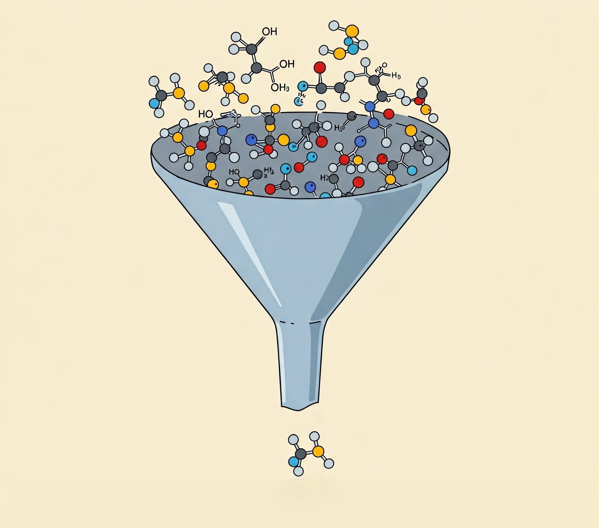

# Description

Virtual screening (VS) in drug discovery and development is a process that enables researchers to filter a collection of molecules to select the most suitable compounds for a particular molecular target. Molecular docking is one of the most useful protocols in virtual screening. In the case of large compound libraries, certain filters (such as ADME) can be applied to reduce the dataset size. Another approach is to filter out molecules with unfavorable force field-based energy (docking score).

<div style="text-align: center;">
  
  <em style="display: block; margin-top: 10px;">Virtual Screening. Image generated via Gemini 2.0 Flash</em>
</div>

Here, I present an AI-driven protocol that allows researchers to cluster compounds based on their docking scores (Glide gscores) and molecular fingerprints (binary representations of a molecule's 2D structure). This approach represents a subtle interplay between Structure-Based and Ligand-Based Drug Design (SBDD/LBDD) and can lead to more efficient screening, especially in cases where the researcher knows a reference molecule with experimentally measured biological activity.

---

# Content

- **`gscores_fps_clusterization_tool.ipynb`** – Jupyter Notebook containing the code for clustering.

---

# Dependencies

The script uses **RDKit** to generate Morgan fingerprints. Therefore, you need to have this library installed in your virtual environment. If you haven't installed RDKit yet, simply run:

```python
pip install rdkit
```
